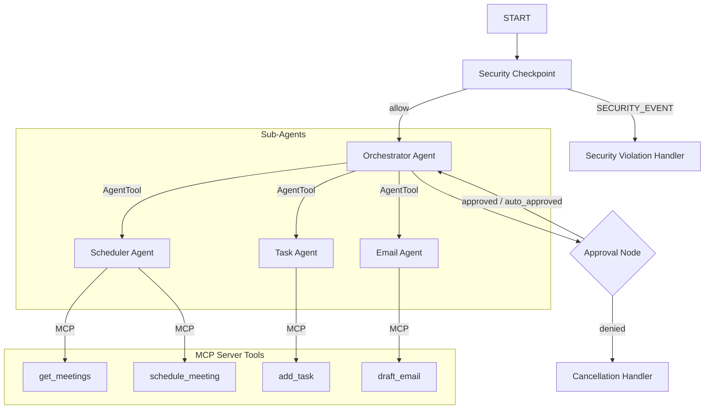

# CalManage Agent Submission Writeup

## Problem Statement
In a fast-paced work environment, professionals struggle to juggle meetings, task prioritization, and drafting communications. Traditional tools are fragmented and require manual context switching. Furthermore, using generic AI assistants introduces severe security risks: leakage of Personally Identifiable Information (PII) and vulnerability to prompt injection attacks when handling calendar invites and emails from unknown parties. 

CalManage solves this by acting as a secure, consolidated multi-agent concierge that automates calendar management, email drafting, and task tracking, guarded by a security checkpoint.

---

## Solution Architecture

---

## Concepts Used & File References

*   **ADK Workflow Graph**: Orchestrates the sequential execution of security, LLM reasoning, and human-in-the-loop nodes (defined in [agent.py](file:///c:/Users/Dinadayal/Documents/agy2-projects/adk-worksspace/calmanage-agent/app/agent.py#L247-L258)).
*   **LlmAgent**: Powers the Orchestrator, Scheduler, Task, and Email assistants (defined in [agent.py](file:///c:/Users/Dinadayal/Documents/agy2-projects/adk-worksspace/calmanage-agent/app/agent.py#L59-L98)).
*   **AgentTool**: Delegates tasks from the Orchestrator to the specialist sub-agents (defined in [agent.py](file:///c:/Users/Dinadayal/Documents/agy2-projects/adk-worksspace/calmanage-agent/app/agent.py#L97)).
*   **MCP Server (Model Context Protocol)**: Exposes tool functions locally via stdio to separate capability code from LLM orchestration (defined in [mcp_server.py](file:///c:/Users/Dinadayal/Documents/agy2-projects/adk-worksspace/calmanage-agent/app/mcp_server.py)).
*   **Security Checkpoint**: Prevents prompt injection, scrubs PII, and handles credentials leaks (defined in [agent.py](file:///c:/Users/Dinadayal/Documents/agy2-projects/adk-worksspace/calmanage-agent/app/agent.py#L100-L185)).
*   **Agents CLI**: Provided template structure, scaffolding, and verification testing (defined in [agents-cli-manifest.yaml](file:///c:/Users/Dinadayal/Documents/agy2-projects/adk-worksspace/calmanage-agent/agents-cli-manifest.yaml)).

---

## Security Design

1.  **PII Scrubbing**: Evaluates user input and redacts email addresses and phone numbers. This prevents leakage of contact info when calling external services or storing logs.
2.  **Prompt Injection Guard**: Detects injection keywords (e.g. `"ignore previous instructions"`) and immediately routes requests to `security_violation_handler` without invoking LLM models.
3.  **Credential Leaks Check (Domain-Specific)**: Blocks any attempts to input passwords, API keys, or private tokens to schedule calendar invites or draft emails, stopping credential theft attempts.
4.  **JSON Audit Logging**: Emits JSON log records containing event evaluations, severity, and status to ensure administrative visibility and compliance.

---

## MCP Server Design
The stdio MCP server exposes 4 tools to sub-agents:
*   `schedule_meeting`: Creates a meeting given title, date/time, and attendees.
*   `get_meetings`: Retrieves current calendar bookings.
*   `add_task`: Saves new items to the to-do list.
*   `draft_email`: Formulates an email draft for the recipient.

---

## HITL (Human-in-the-Loop) Flow
Sensitive actions such as drafting/sending emails require explicit human consent. If `"send email"` or `"delete"` is present in the input:
1. The `approval_node` yields `RequestInput` with the interrupt `approved`.
2. The workflow pauses and prompts the user in the UI: `"Do you approve this sensitive action? (yes/no)"`.
3. Execution resumes only when the user inputs `"yes"` or `"no"`.

---

## Demo Walkthrough
Refer to the three sample test cases in the `README.md` (Calendar scheduling, email draft approval, and prompt injection blocking) for step-by-step UI manual testing.

---

## Impact & Value Statement
CalManage boosts executive productivity by saving time spent switching between calendar, email, and task applications. By applying edge-based security filters at the start of the workflow, it ensures that professional data stays private and safe from malicious injection payloads.
